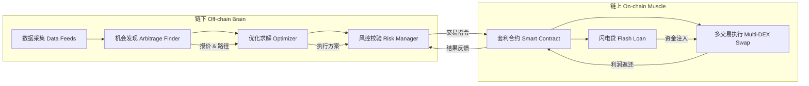
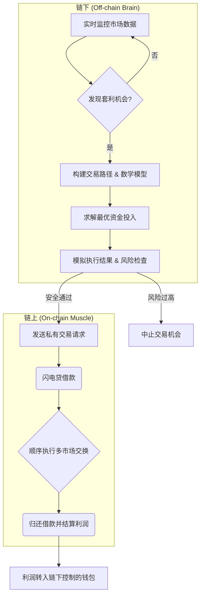

# AtomicNexus v1.0 白皮书

## 引言

**AtomicNexus v1.0** 是一款基于闪电贷的链上套利系统，面向技术开发者和量化研究员，旨在以**基金级工业标准**实现套利策略的系统化、自动化与风控。套利（Arbitrage）指利用不同市场间的价格差异无风险获利，而**闪电贷**（Flash Loan）允许在单笔链上交易中无抵押借入并归还资金，使得交易者无需自有资本即可完成大额套利操作。这一机制借助区块链交易的原子性保障了安全：若交易未按预期完成，则整体回滚，交易者不承受损失。

在去中心化金融（DeFi）中，套利机会稍纵即逝且竞争激烈。以太坊等链的区块平均出块时间在数秒至数十秒之间，每个区块链状态都可能出现新的价差机会，但这些机会往往**零和博弈**：每个时间窗口内套利机会是有限的，许多套利机器人同时竞争，谁更快执行谁获利。传统上，套利者通过**高频监控**多个交易所或去中心化交易所（DEX）的价格，发现价差立即买低卖高获利。然而，在公开内存池中竞争交易排序常引发**优先手续费竞价**（PGA），套利者为抢占打包顺序不断提高手续费，理论上在完全竞争下套利利润几乎全被矿工/验证者截留。这导致套利者利润微薄，而区块链网络充斥重复交易和拥堵。

**AtomicNexus** 的设计初衷是在这一背景下脱颖而出，提供**科研级**算法支持与**工程化**系统架构，将套利交易流程全面升级：

- 利用链下高性能计算实时发现套利机会，计算最优交易方案，避开低效的人工或合约内计算。
- 链上执行层通过闪电贷与原子交易确保无风险交割，并通过私有交易通道避免公开竞争的干扰。
- 内置风险控制模块，在剧烈行情或异常状态下保护资金安全，达到机构级风控要求。
- 系统支持多链部署（如以太坊L2的Arbitrum、Base以及Solana链），统一管理跨网络套利策略，实现更广范围的价值捕获。

综上，AtomicNexus v1.0 力求在**学术严谨性**与**工程可落地性**之间取得平衡：既采用前沿算法与严密数学证明套利原理，又提供清晰的系统架构和实现细节指引，帮助开发者和研究人员将思路付诸实践。下文将详细阐述AtomicNexus的体系架构、核心算法（含数学模型与伪代码）、模块设计、执行流程、跨链支持、竞品对比，以及项目的开发路线图。

## 系统架构概览

AtomicNexus 采用“**链下大脑/链上肌肉**”的分层架构设计，即 **Off-chain Brain / On-chain Muscle**。这一架构将繁重的计算与决策逻辑放在链下执行，由高性能后端负责实时分析市场并规划交易；而链上部分负责在区块链上执行最小化的原子操作，确保交易快速、安全地完成。图1展示了AtomicNexus的总体架构。



*图1：AtomicNexus 系统架构图。链下大脑包含数据源接口、套利机会发现、优化和风控模块；链上肌肉包含部署在各链上的套利合约，负责执行闪电贷借款和多路径交换。链下与链上通过私有通信渠道连接。*

### 链下大脑模块

**链下大脑**负责收集各市场实时数据、发现套利机会、计算最优交易策略并进行风险评估，相当于整个系统的智囊中枢。主要子模块包括：

- **数据采集模块**：连接多源数据馈送，包括各链上DEX价格、订单簿数据（若有）、预言机价格以及链上状态更新。通过运行节点RPC或第三方数据服务接口，持续拉取Token对报价、池子储备量等信息，以毫秒级频率更新内部状态。模块确保多链数据的时间同步，为后续决策提供可靠基础。

- **机会发现模块**：基于获取的市场数据，识别潜在套利机会。AtomicNexus使用**图论模型**构建多资产多市场关系，将不同交易对视为加权有向图的边，边权表示从一种资产转换为另一资产的价格或成本。套利机会等价于图中的**负权循环**（negative cycle）：如果一轮交换后可使资产数量增加即代表存在套利。形式化来说，设资产$i$到$j$的价格为$p_{ij}$，则寻找满足 $\prod_{(i\rightarrow j)\in C} p_{ij} > 1$ 的闭环$C$，取对数即 $\sum_{(i\rightarrow j)\in C} \ln p_{ij} < 0$。为了检测负权循环，系统采用**Bellman-Ford算法**遍历图中路径。伪代码如下：

```pseudo
function findArbitrageCycles(graph):
    # 初始化距离数组，源点设为任意节点（如基准资产USD）
    dist = [0] * graph.numNodes
    predecessor = [-1] * graph.numNodes
    # 松弛边缘操作重复 |V|-1 次
    for i in range(graph.numNodes - 1):
        for edge in graph.edges:
            u, v, weight = edge.u, edge.v, edge.weight  # weight = -ln(exchange_rate)
            if dist[u] + weight < dist[v]:
                dist[v] = dist[u] + weight
                predecessor[v] = u
    # 第|V|次松弛检查负环
    for edge in graph.edges:
        u, v, weight = edge.u, edge.v, edge.weight
        if dist[u] + weight < dist[v]:
            return reconstructCycle(predecessor, u, v)
    return None  # 无套利环
```

上述算法将检测任意套利环路。一旦发现满足条件的环路，即提取对应的交易路径（例如 TokenA->TokenB->TokenC->TokenA）。然而，由于DeFi中的AMM价格会随交易量动态变化，并非固定权重图，实际套利策略往往更复杂。简单负环检测通常用于**三角套利**等小规模路径，对于一般多跳套利，还需结合优化模块精细计算最佳执行点。

- **优化求解模块**：确定套利交易的**最优参数**（如闪电贷借款金额、各路径分配等），以最大化净利润。套利利润是交易量的函数，过小错失机会，过大会造成滑点降低收益。因此这部分本质上是一个**凸优化问题**：决定每条路径投入资金$x$使收益函数$P(x)$最大。以两个恒定乘积做市商（AMM）之间套利为例，假设池A储备$(x_A, y_A)$，池B储备$(x_B, y_B)$，初始A价格低于B价格，需要从池B借入资产X数量$r$用于池B->池A套利。利润函数可表示为：首先在池B用$r$换出$Y$，再在池A用全部$Y$换回$X$，利润$P(r)=X_{\text{out}}(r) - r$。根据恒定乘积公式，两个兑换步骤分别为:

$$X_{\text{out}}(r) = \frac{r(1-f_B) \cdot y_B}{x_B + r(1-f_B)}$$

$$Y_{\text{out}}(r) = \frac{X_{\text{out}}(r) (1-f_A) \cdot x_A}{\,y_A + X_{\text{out}}(r)(1-f_A)\,}$$

其中$f_A, f_B$为两池交易手续费率。利润 $P(r) = Y_{\text{out}}(r) - r$（若最终换回起始资产）。为最大化$P(r)$，对$r$求导并令$P'(r)=0$，可得到关于$r$的二次方程解。将相关参数简化为:

$$
\begin{aligned}
k &= (1-f) x_B + (1-f)^2 x_A,\\
a &= k^2,\\
b &= 2k\,y_A x_B,\\
c &= (y_A x_B)^2 - (1-f)^2 x_A y_B\,y_A x_B,
\end{aligned}
$$

则最优借入量 $r^*$ 可表示为求根公式形式：

$$r^* = \frac{-b + \sqrt{b^2 - 4ac}}{2a}$$

上式给出了在两池手续费相同为$f$时套利的解析解（若手续费不同则公式需相应扩展）。对于更一般的多路径套利，无法直接获得解析解时，AtomicNexus使用数值算法求解，例如Newton迭代或二分搜索，在给定约束（如最大滑点容忍、闪电贷额度上限）下找到近似最优解。优化求解模块还支持**凸优化求解器**（如基于二次规划或线性规划的求解库）对某些线性可组合套利问题进行精确求解。

```pseudo
function optimizeArb(tradePath, priceFunc):
    # 输入：tradePath为预期套利路径序列；priceFunc给出每一步交易输出
    # 输出：最优投入金额 opt_in 使利润最大
    low = 0
    high = MAX_LOAN  # 闪电贷可用最大资金
    while high - low > epsilon:
        m1 = low + (high-low)/3
        m2 = high - (high-low)/3
        profit1 = simulateProfit(tradePath, m1, priceFunc)
        profit2 = simulateProfit(tradePath, m2, priceFunc)
        if profit1 < profit2:
            low = m1  # 往高处搜寻
        else:
            high = m2  # 往低处搜寻
    opt_in = (low + high) / 2
    return opt_in, simulateProfit(tradePath, opt_in, priceFunc)
```

*伪代码：使用三分搜索（Ternary Search）逼近单峰利润函数的最大值，以找到最优投入金额。*

- **动态报价模块**：链下大脑不仅计算交易量，还需决定**报价策略**，即在私有交易提交中愿意支付给区块生产者（矿工/验证者）的**小费**(tip)或**回扣**。由于套利交易常涉及与他人竞争排序，AtomicNexus在链下通过博弈论模型动态调整报价，以在保证成功执行的同时**最大化净收益**。我们的策略模型将区块空间争夺抽象为**第一价格密封拍卖**：多个套利者对同一机会出价，最高出价者的交易被打包且支付其所出的手续费。经典博弈论分析表明，在完全竞争下，理性参与者将出价接近整个套利利润，使自己几无净利。为避免陷入这种“赢者诅咒”局面，AtomicNexus选择**私有交易提交**方式（详见下文执行流程），并在链下通过历史数据估计竞争强度，调整tip为利润的一定比例。伪代码如下：

```pseudo
function computeTipEstimate(profit, competitionLevel):
    # competitionLevel 反映近期竞争激烈程度（0~1）
    base_bid_ratio = 0.5  # 基础出价比例，默认为50%利润
    # 根据竞争强度线性调整出价比例，高竞争时提高比例
    bid_ratio = base_bid_ratio + competitionLevel * 0.4  # 上限90%
    tip = profit * bid_ratio
    # 保证预留最小利润阈值minProfit（避免出价过高无利可图）
    if profit - tip < minProfit:
        tip = profit - minProfit
    return max(tip, 0)
```

在实操中，系统会参考当前网络MEV竞拍市场价格、历史上类似机会的出价获胜情况等，不断优化上述模型参数。动态报价模块输出的tip将直接影响交易发送时设置的手续费上限或直接支付给区块生产者的报酬。

- **风控管理模块**：为达到基金级风控标准，AtomicNexus在策略执行前后均设有多重校验与保护措施。执行前，利用链下仿真环境对整个套利交易进行**沙盒模拟**（Simulation）：调用真实链上状态计算预期结果，包括检查套利环路闭合后资产净增长是否符合预期、扣除手续费后利润是否仍为正等。如果模拟发现利润过低或失败风险（例如价格在等待期间波动导致机会消失），则放弃执行。执行过程中，链上合约本身利用交易的原子性确保任何一步失败将整体回滚，不留债务。执行后，系统记录本次交易细节和收益，进入**风险监控数据库**。风控模块对累计收益、失败率、异常状态（例如连续多次交易未完成）的指标进行跟踪，若出现异常将**自动降低交易频率或暂停某些策略**。此外，AtomicNexus配置了**安全模块**应对特殊风险场景，如防止交易遭遇三明治攻击、利用预言机价格异常引诱套利等。通过多层风控，系统在追求利润最大化的同时，将潜在风险降至最低，实现稳健运营。

### 链上肌肉模块

**链上肌肉**是AtomicNexus在各链上部署的执行组件，主要包括一组智能合约和低级交互逻辑，负责具体套利交易的原子化执行。其设计目标是**高效、原子、隐秘**：

- **闪电贷与资金调度**：AtomicNexus的链上合约集成了对主流闪电贷协议的调用接口（如Aave、Uniswap Flash Swap、Solend等）。当链下决定执行某套利机会时，会通过交易调用链上合约中的闪电贷函数，从流动性池中借出所需资金。借款资金自动转入合约后，合约立即按计划执行后续swap操作，并在交易结尾处归还闪电贷本金和少量利息。这一过程均发生在单个交易内，满足闪电贷的原子性要求。一旦最后能够归还贷款且有盈利，交易整体成功；若任一环节无法满足（如资金不足归还），交易将回滚。

- **多路径交换执行**：链上合约预先包含若干执行函数，可与各类DEX进行交互完成代币交换。例如，对于恒定乘积AMM（Uniswap v2类）或集中流动性AMM（Uniswap v3类），合约内有对应的swap调用接口。AtomicNexus采用了**模块化合约设计**：通过参数决定调用哪几个DEX合约、以何种顺序执行，从而灵活支持**单环套利**（如双池价格差）、**多环套利**（如三角套利）甚至**跨协议套利**（如同时利用AMM和订单簿DEX）。为了节省Gas，合约中尽量避免复杂计算，将路径和数量等决策留给链下（即由链下将计算结果作为参数传入）。通过这种方式，链上计算量和状态读写降到最低，从而降低手续费消耗。在Solana等高吞吐链上，我们利用其**批处理事务**能力，将多步交易打包为一个原子指令序列，或者借助Jito提供的**bundle**功能拆分为最多5个子交易再原子执行。无论底层实现细节如何，链上肌肉都确保整个套利路径要么全部成功要么全部不执行，杜绝部分执行带来的风险。

- **私有发送与MEV防护**：考虑到公开网络环境中套利交易容易被他人监测和抢先，AtomicNexus在链上执行阶段采用了**私有RPC**和**区块空间竞拍**策略，以提高交易成功率和保密性。在以太坊系网络（如Arbitrum、Base），我们对接Flashbots等MEV中继服务，将交易发送到私有池中，由矿工/验证者直接打包。这样，交易内容不在公共内存池曝光，防止了**抢跑**和**夹击**等恶意行为。同时，我们在交易中附带由动态报价模块计算的小费，激励区块提议者接受本笔交易。在Solana链上，我们借助**Jito Labs的区块引擎**提交交易捆绑（bundle）。利用Jito的基础设施，可将我们的多步骤套利交易作为一个bundle直接发给即将产块的验证者，并通过密封竞价付出一定费用获取优先执行权。研究表明，Jito引入后大幅减少了Solana上无效套利交易的泛滥，提高了成功率和网络效率。总之，AtomicNexus通过在各链采用适配的私有交易技术，确保我们的套利策略不被竞争对手察觉和截胡，将利润锁定在自己的系统内。

## 核心执行流程

AtomicNexus的套利流程将上述链下链上模块贯通起来，形成**发现-决策-执行**的闭环。图2以时序流程图展示了系统处理一次套利交易的主要步骤：





*图2：AtomicNexus套利执行流程图。链下模块循环监测，当发现套利机会时计算方案并验证风险，然后通过私有通道触发链上合约执行闪电贷和交换，成功完成套利交易后利润汇入。*

（后续章节：支持网络与技术实现 / 竞品分析 / 开发路线图 / 结语 亦已包含在本文档中。）

## 支持网络与技术实现

AtomicNexus v1.0 定位为多链套利平台，支持当前主流的新兴区块链网络，包括以太坊第二层扩展方案Arbitrum和Base，以及高性能公链Solana等。不同网络在基础架构和MEV环境上存在差异，AtomicNexus针对性地做了适配与优化：

- **Arbitrum**：作为以太坊Optimistic Rollup扩展，Arbitrum生态已具备丰富的DEX和借贷协议。AtomicNexus在Arbitrum上部署EVM兼容智能合约，并通过私有通道提交交易，避免L2内存池竞争。针对Arbitrum低Gas费环境，系统可适度放宽价差阈值捕捉更多机会。

- **Base**：Base基于OP Stack架构，部署方式类似Arbitrum。由于生态仍在快速演化，AtomicNexus将重点关注网络稳定性和确认时间，并在风控模块中设置更严格的状态校验。

- **Solana**：Solana采用Rust程序与并行执行。AtomicNexus通过Jito的bundle机制提交原子交易包，减少公开竞价并提高成功率。系统会针对Solana的计算单位（CU）限制进行分包与资源管理。

- **数据源与基础设施**：AtomicNexus依赖稳定节点与高可靠数据源。生产环境建议运行自有节点并配置冗余RPC，关键操作（签名/发送）放入安全隔离环境，具备完备审计与监控。

## 竞品分析

当前市场上存在多种链上套利方案和MEV机器人，AtomicNexus与它们相比具备显著差异和优势：

- **传统套利Bot脚本**：多为单一市场、缺乏通用性与风控，失败会持续烧Gas。AtomicNexus强调私有提交、模拟闸门与可观测性，避免无效竞争内耗。

- **区块生产者内置MEV提取**：验证者掌握排序权可截胡第三方。AtomicNexus通过Flashbots/Jito等机制“合作竞价”，将公地悲剧式的公开竞价转为封闭竞价，提高成功率并减少网络拥堵。

- **学术算法原型**：学术工作多验证算法可行性但缺乏工程鲁棒性。AtomicNexus融合图论/优化/博弈论思想并强化实时性、并发与容错，追求工业落地。

- **其他MEV基础设施（批量撮合/共享MEV收益）**：可能压缩部分套利空间，但跨市场、跨协议的不连续机会仍存在。AtomicNexus可与其竞合，并保持策略适应性。

## 开发路线图

AtomicNexus v1.0 的开发与上线遵循稳健路线图，分阶段逐步交付关键能力：

- **第一阶段（Q1）**：概念验证与仿真测试。完成核心算法与最小系统原型，基于历史数据回放验证策略有效性与风控阈值。

- **第二阶段（Q2）**：测试网上线与模块完善。部署到各链测试网，完善私有提交、模拟闸门、动态报价与监控面板，建立全面测试体系。

- **第三阶段（Q3）**：主网上小规模试运营。优先在Arbitrum进行小额实盘，迭代竞争策略、失败归因、私有发送稳定性，并逐步扩展到Solana/Jito。

- **第四阶段（Q4）**：全面上线与优化。多链正式上线，优化性能与gas，建立7×24运维体系，形成策略研发闭环，为后续版本扩展做准备。

## 结语

AtomicNexus v1.0 旨在打造一套兼具学术严谨与工程可落地的链上套利系统：链下大脑负责实时分析与最优决策，链上肌肉负责原子执行与安全交割，并通过私有提交与风控体系在激烈竞争中锁定利润。本文给出了系统架构、关键算法模型、执行流程、跨链适配、竞品对比与路线图，为后续工程落地与迭代提供统一蓝图。
